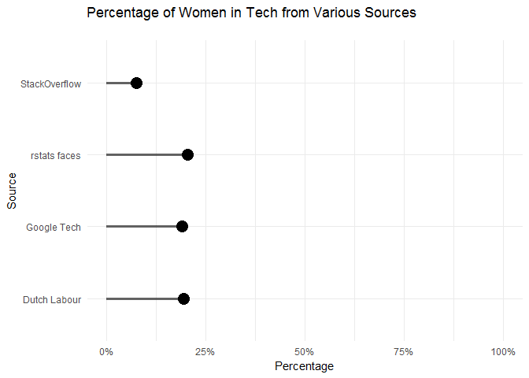
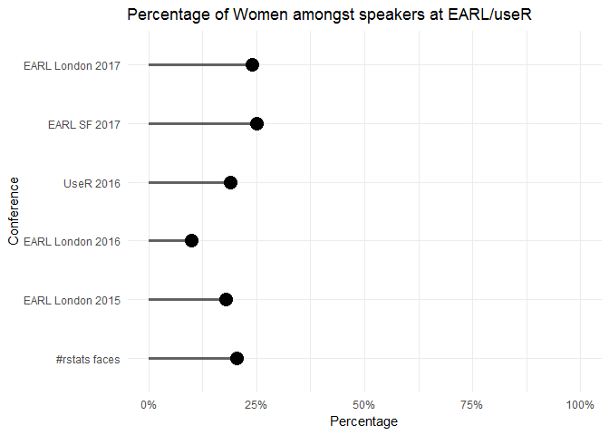

# The faces of #rstats: a (brief) exploration of gender in the R community
Adnan Fiaz  


The representation of women in technology is gaining more and more focus. In the R community this has lead to the foundation of R Ladies, the awarding of a grant by the R Foundation to them and the offering of a scholarship by the useR conference (the latter two are also about inclusion of other minorities). This is a good thing but it does make me wonder: how do we measure success? how will we know these actions have lead to a better situation? And by how much?

This blogpost by Maelle Salmon and this one by Colin Fay inspired me to explore this issue as follows: if we could somehow measure the representation of women currently in our community we can keep track of this. As Mango are organisers of the EARL conference it would also help us assess our own performance.

So I set out to measure the proportion of women among the faces of #rstats. I used Colin's code to first retrieve the profile pictures. 


```r
# Taken from http://colinfay.me/playing-with-rstats-and-microsoft-computer-vision-api/
library(dplyr)
library(rtweet)
token <- create_token(app = "rstats_faces", consumer_key = CONSUMER_KEY, 
                      consumer_secret = CONSUMER_SECRET)

users <- search_users(q= '#rstats', n = 1000, parse = TRUE) %>%
  unique() %>% 
  mutate(profile_image_url = gsub("_normal", "", profile_image_url))
```

Then I used the Microsoft Face API to tell me if the picture was of a man or a woman. Colin used `lapply` but I thought I'd give `purrr::map` a try.


```r
library(httr)
library(purrr)
getGender <- function(myURLs){
  requestURL <- "https://westus.api.cognitive.microsoft.com/face/v1.0/detect"
  parameters <- list(returnFaceAttributes="gender")
  
  result <- map(myURLs, 
                function(myURL) {
                  Sys.sleep(3)
                  POST(requestURL, query=parameters, 
                       add_headers('Content-Type'="application/json",
                                   'Ocp-Apim-Subscription-Key'=FACE_API_KEY), 
                       body=sprintf('{"url":"%s"}', myURL)) %>% 
                    content("parsed")
                  } 
                ) %>% 
    # check if a face was detected and no error was returned
    map_chr(~ ifelse(length(.x)>0 && !("error"%in%names(.x)), .x[[1]]$faceAttribute$gender, NA))
  
  return(result)
}

usersWithGender <- users %>% 
  mutate(gender= getGender(profile_image_url)) %>% 
  select(user_id, gender)
```


From Maelle's great collage we already knew not all profile pictures are of people and the Face API does not return any predictions in these cases. There are also some instances the Face API wrongfully didnt detect a face (not even one of our EARL keynote speaker, sorry Hillary Parker). Altogether the Face API detected  314 faces and the proportion of women among the #rstat faces is 20.4% (click [here](https://s-media-cache-ak0.pinimg.com/736x/57/6d/fe/576dfe57df89ef97cd31fd7601651bc2.jpg) for the pie chart). This is only an estimate and it might not even be a very accurate one but we can compare it with other estimates:

<!-- -->

Although the percentage of women in technology at Google and in the Netherlands are based on an entirely different populations our estimate is close to these two. It is fair to assume, without any further knowledge, that the percentage of women in the #rstats community will be similar to the percentage of women in the wider tech community. Nevertheless there are other issues with the general estimates. The industry categorisation of the Netherlands means that we're not capturing all tech jobs (for example, those in finance aren't included). Also there has been quite the controversy on Google's gender gap which may mean that estimate is too low as well. And finally in the discussion on the results of the StackOverflow Developer Survey it is stated their estimate is probably too low. 

If we knew about these issues then why did we use them in the first place? Because it's the best we could find and that may be a problem. Without an accurate measure and without knowing how accurate our own measure is, it is clearly impossible to use it as an KPI ^[We don't give up that easily. Another approach to validating our estimate is to count the members of all R-Ladies groups. After correcting for duplicates this might give us a more accurate estimate but it is beyond the scope of this blogpost.]. So was this whole exercise just an excuse for us to play with the Microsoft Face API? Perhaps. Have we wasted your time by making you read it? Perhaps not. In the next section we explore a different use for our approach.

### Let's go to the conference!

Our approach so far has been to use profile pictures, determine the gender and then calculate the percentage of women. By applying this approach to conferences we can semi-automatically determine the percentage of women for these conferences and then compare them with each other and year over year. The conferences we will be looking at are EARL and useR. 

First, we have to do some webscraping to retrieve the profile pictures. This is relatively easy with the **rvest** package. Below is the code for EARL London 2016.


```r
library(rvest)
earl2016URL<- "https://earlconf.com/2016/london/speakers"
# We used the SelectorGadget to determine the name of the xml node containing the image tage
speakers <- read_html(earl2016URL) %>% 
  html_nodes(".col-md-3 img") %>% 
  html_attr("src")

earl2016Genders <- getGender(paste0(earl2016URL, speakers))
```

For the EARL conferences of 2017 the above code doesn't work because the website was updated. Unfortunately for our sys admin I know where he lives and he helped me figure out how to get the image URL's for all the speakers. It involved some wrangling with json but luckily we have the **jsonlite** and **purrr** packages for that.


```r
library(jsonlite)
earlLondon2017 <- read_json("https://earlconf.com/london/londonSpeakers.json")
earlLondon2017Genders <- earlLondon2017 %>% 
  map("headshot") %>% 
  map(~paste0("https://earlconf.com/img/headshots/london/", .x)) %>% 
  map_chr(~getGender(.))

earlSF2017 <- read_json("https://earlconf.com/sanfrancisco/sanFranciscoSpeakers.json")
earlSF2017Genders <- earlSF2017 %>% 
  map("headshot") %>% 
  map(~paste0("https://earlconf.com/img/headshots/sanfrancisco/", .x)) %>% 
  map_chr(~getGender(.))
```

I wasn't able to find profile pictures of the speakers for useR 2017 but for useR 2016 I was able to use almost the same code as above.  


```r
user2016URL <- "http://schedule.user2016.org/directory/speakers"
user2016Genders <- read_html(user2016URL) %>% 
  html_nodes("img") %>% 
  html_attr("src") %>% 
  map(~paste0("http:", .x)) %>% 
  map_chr(~getGender(.))
```

Finally, armed with the web scraping results we can plot the gender distribution for different conferences.

<!-- -->

Compared to 2016  the percentage of women speakers at EARL has gone up. This reflects the effort that has been put in by the EARL team and will hopefully continue to improve in the future. The estimate for useR 2016 is surprisingly close to our estimate for #rstat faces. The organisation for useR 2017 will probably improve on this considering the facilities they're providing and the location (who doesn't want to go to Brussels!).

### Summary


